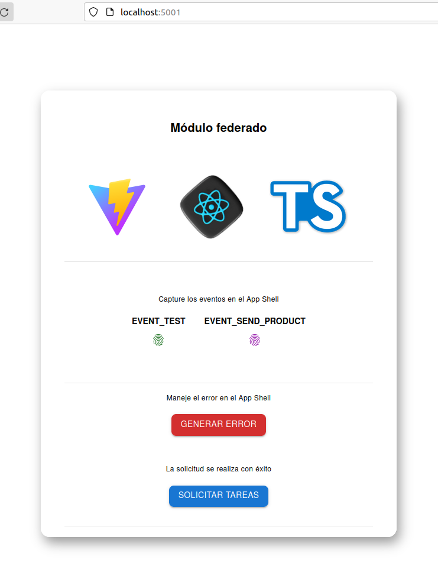

<h1 align="center" >
    Micro Frontend - Implementación de concepto
</h1>

    

 

  <a href="https://github.com/pmNiko/mfe-parcel/wiki">Lea más acerca de su implementación</a>

 

> .[!TIP]
> Esta es una nota de prueba.

---

| Tecnología                       | Documentación                                                                  | Descripción                                                  |
| -------------------------------- | ------------------------------------------------------------------------------ | ------------------------------------------------------------ |
| React                            | https://react.dev                                                              | Interfaces de usuario                                        |
| Typescript                       | https://www.typescriptlang.org                                                 | Extiende JS - Tipado                                         |
| react-error-boundary             | https://github.com/bvaughn/react-error-boundary                                | Manejos de errores del ciclo de vida de componentes de React |
| Vite                             | https://vitejs.dev                                                             | Empaquetador de modulos                                      |
| @originjs/vite-plugin-federation | https://github.com/originjs/vite-plugin-federation#externalstringpromisestring | Plugin de Vite                                               |
| MUI Material UI                  | https://mui.com/                                                               | Biblioteca de Componentes                                    |

---

 

 Parcel 1 (Remote - App)

    

---

 

---

    

        ¿Como funciona?
    

    

        El parcel representa un fragmento de la app general, que será inyectada de manera remota en el App Shell.
          Este será desarrollado de manera pararela y posteriormente expuesto para ser consumido. 
          Una de las ventajas de esta estrategia es que nos permite desarrollar de manera vertical sin afectar 
        al resto del equipo. Básicamente consiste en escalar gradualmente el proyecto para lograr los objetivos. 
          Para conocer más acerca de su implementación y consumo revise la wiki.
    

- [wiki deploy](https://github.com/pmNiko/mfe-parcel/wiki/4%E2%80%90Deploy)

 

---

    

        Aplicación Contenedora
    

    

        App Shell será aquella aplicación que consuma estos parcel o componentes para renderearlos en su layout bajo demanda.
        En este readme solo se hará referencia al repositorio del mismo para que pueda descargar y verificar su estructura.
    

- [App Shell](https://github.com/pmNiko/mfe-shell)

 

---
