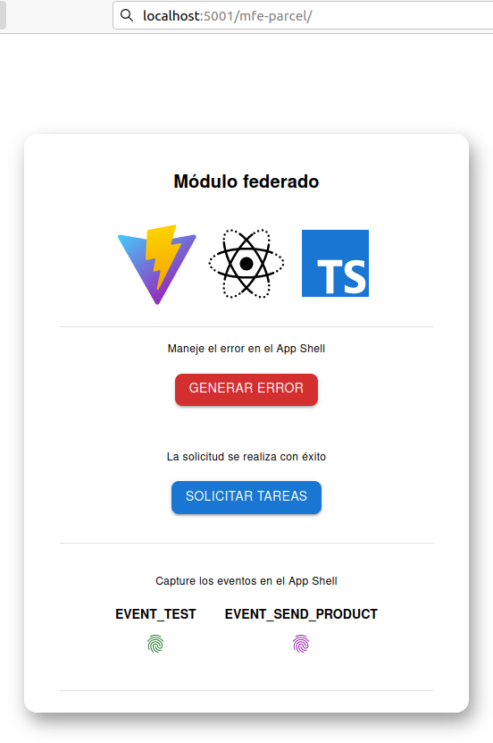

<h1 align="center" >
    Micro Frontend - Implementación de concepto
</h1>

    

 

  <a href="https://github.com/pmNiko/Microfront-Concept-Remote-App-Test/wiki">Lea más acerca de su implementación</a>

 

---

| Tecnología                       | Documentación                                                                  | Descripción                                                  |
| -------------------------------- | ------------------------------------------------------------------------------ | ------------------------------------------------------------ |
| React                            | https://react.dev                                                              | Interfaces de usuario                                        |
| Typescript                       | https://www.typescriptlang.org                                                 | Extiende JS - Tipado                                         |
| react-error-boundary             | https://github.com/bvaughn/react-error-boundary                                | Manejos de errores del ciclo de vida de componentes de React |
| Vite                             | https://vitejs.dev                                                             | Empaquetador de modulos                                      |
| @originjs/vite-plugin-federation | https://github.com/originjs/vite-plugin-federation#externalstringpromisestring | Plugin de Vite                                               |
| MUI Material UI                  | https://mui.com/                                                               | Biblioteca de Componentes                                    |

---

 

 Parcel 1 (Remote - App)

    

---

 

 Solicitud de tareas exitosa

    

---

 

 Solicitud erronea

    

---

 

 Tareas solicitadas

    

---

    

        ¿Como funciona?
    

    

        El parcel representa un fragmento de la app general, que será inyectado de manera remota al shell o host.
          Este será desarrollado de manera pararela a la app shell y posteriormente expuesto para ser absorbido. 
          Una de las ventajas de esta estrategia es que nos permite desarrollar de manera vertical sin afectar 
        al resto de la app. Básicamente consiste en escalar graduelmente nuestra app para hacer crecer sus funcionalidades. 
          Para conocer más acerca de su implementación y consumo revise la wiki.
    

- [wiki](https://github.com/pmNiko/Microfront-Concept-Remote-App-Test/wiki/4%E2%80%90Deploy)

 

---
